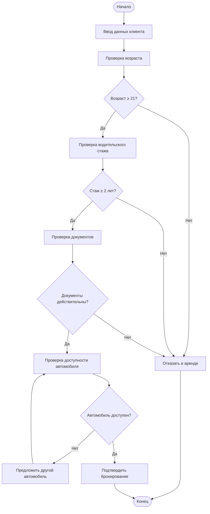

# Flowchart

```mermaid
flowchart TD
    Start([Начало]) --> A[Ввод данных клиента]
    A --> B[Проверка возраста]
    B --> C{Возраст ≥ 21?}
    C -- Нет --> D[Отказать в аренде]
    D --> End([Конец])
    C -- Да --> E[Проверка водительского стажа]
    E --> F{Стаж ≥ 2 лет?}
    F -- Нет --> D
    F -- Да --> G[Проверка документов]
    G --> H{Документы действительны?}
    H -- Нет --> D
    H -- Да --> I[Проверка доступности автомобиля]
    I --> J{Автомобиль доступен?}
    J -- Нет --> K[Предложить другой автомобиль]
    K --> I
    J -- Да --> L[Подтвердить бронирование]
    L --> End
```
