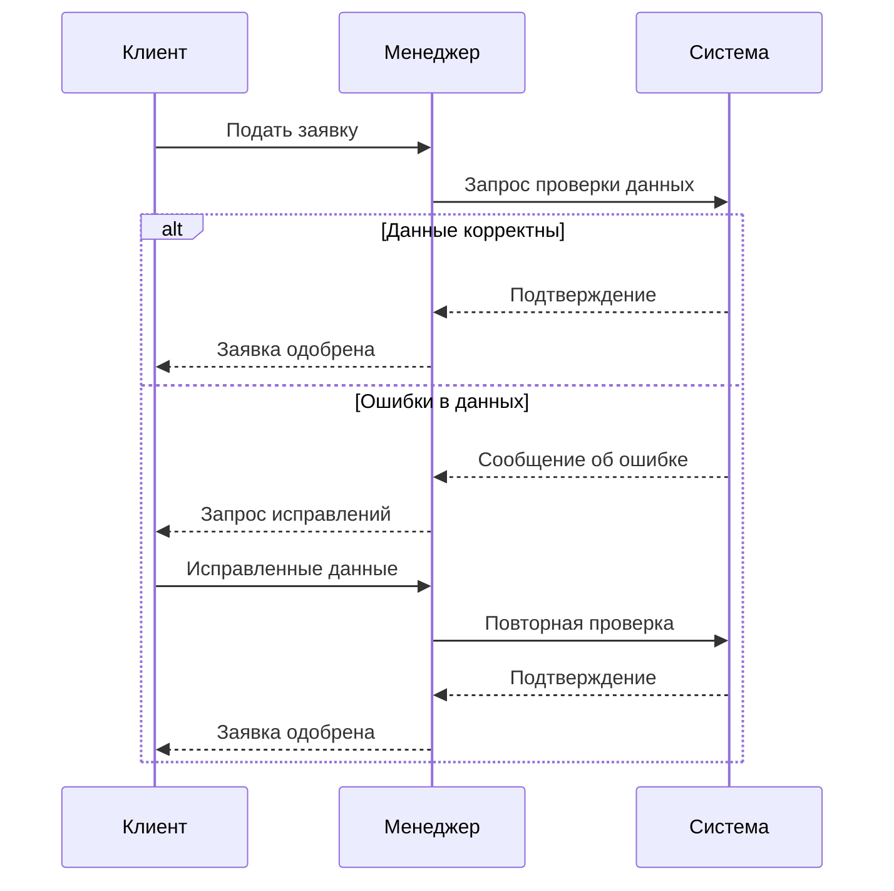

# Sequence Diagram

```mermaid
sequenceDiagram
    participant Клиент
    participant Менеджер
    participant Система

    Клиент->>Менеджер: Подать заявку
    Менеджер->>Система: Запрос проверки данных
    
    alt Данные корректны
        Система-->>Менеджер: Подтверждение
        Менеджер-->>Клиент: Заявка одобрена
    else Ошибки в данных
        Система-->>Менеджер: Сообщение об ошибке
        Менеджер-->>Клиент: Запрос исправлений
        Клиент->>Менеджер: Исправленные данные
        Менеджер->>Система: Повторная проверка
        Система-->>Менеджер: Подтверждение
        Менеджер-->>Клиент: Заявка одобрена
    end
```
