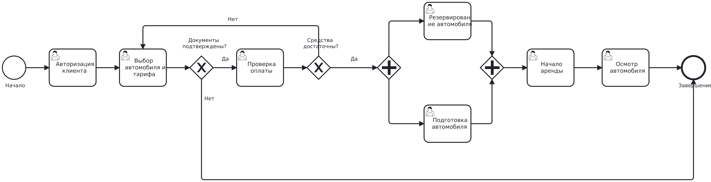
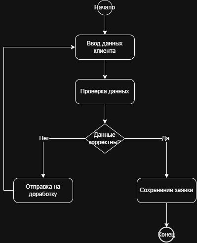

# Отчёт по лабораторной работе №1

**Тема:** Моделирование процессов с использованием Git и визуальных нотаций

**ФИО:** Горбунов Кирилл

**Группа:** СДП-УИР-241


---

## 1. Краткое описание процесса

**Название процесса:** Аренда автомобиля (каршеринг)

Процесс описывает аренду автомобиля через сервис каршеринга. Клиент регистрируется в приложении и проходит верификацию документов. Система проверяет водительское удостоверение и возраст клиента. При успешной проверке клиент выбирает автомобиль на карте и бронирует его. Система проверяет доступность автомобиля и уровень заряда топлива. Клиент открывает машину через приложение, осматривает её и начинает поездку. По завершении поездки клиент паркует автомобиль в разрешённой зоне и завершает аренду. Система рассчитывает стоимость на основе времени и пробега, а затем списывает средства с привязанной карты клиента.


Полное описание процесса находится в файле [`docs/process_description.md`](docs/process_description.md).


---

## 2. Диаграммы

### 2.1. BPMN-диаграмма

Исходник: [`diagrams/process.bpmn`](diagrams/process.bpmn)  
Изображение: [`diagrams/process-bpmn.png`](diagrams/process-bpmn.png)





### 2.2. UML Activity Diagram

Исходник: [`diagrams/activity.drawio`](diagrams/activity.drawio)  
Изображение: [`diagrams/activity-uml.png`](diagrams/activity-uml.png)





### 2.3. Sequence Diagram (Mermaid)

Файл с кодом: [`docs/sequence.md`](docs/sequence.md)


### 2.4. Flowchart (Mermaid)

Файл с кодом: [`docs/flowchart.md`](docs/flowchart.md)


---

## 3. Сравнение diff для текстового и бинарного форматов

После добавления в BPMN-диаграмму одного дополнительного элемента были выполнены команды:

```bash
git diff HEAD~1 HEAD -- lab1/diagrams/process.bpmn
git diff HEAD~1 HEAD -- lab1/diagrams/process-bpmn.png
```

Для файла `process.bpmn` (XML, текстовый формат) Git показал конкретные изменённые строки. Для файла `process-bpmn.png` (бинарный формат) Git вывел только сообщение `Binary files ... differ`, без детализации.

_Скриншоты вывода приведены ниже:_

- Скриншот diff для `.bpmn`: _здесь_
- Скриншот diff для `.png`: _здесь_


---

## 4. История коммитов

```
Initial commit: create repo structure
Add process description
Add all diagrams (BPMN, UML Activity, Sequence, Flowchart)
Update BPMN: add minor element
Add lab report
```


---

## 5. Выводы

Я освоил базовые команды Git (clone, add, commit, push), научился работать с SSH-ключами и настраивать глобальные параметры. Увидел разницу между текстовыми (.bpmn, .md) и бинарными (.png) форматами при версионировании. Закрепил навыки построения диаграмм в нотациях BPMN, UML Activity, Sequence и Flowchart.
